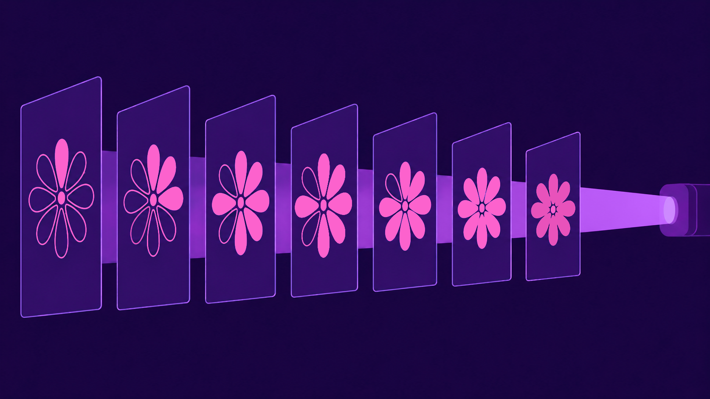

# bit-plane codec



`bpcodec` is a strict-lossless Rust image codec for 8-bit grayscale images. It normalizes polarity per image, encodes pixels bit-plane progressively from bit 7 down to bit 0, and uses a trained global fixed-point binary context model. Decoding is fully CPU-based, efficient and deterministic.

## Build

```sh
cargo build --release
# or with Metal enabled:
cargo build --release --features metal
```

## Usage

Train a model on a simple of target images:

```sh
bpcodec train --input-dir ./images --model model.bpm
```

Then encode image with the model:

```sh
bpcodec encode --model model.bpm --input image.png --output image.bpc # add a `--use-metal` if has enabled
# or generate a pack for multiple images:
bpcodec pack --model model.bpm --input-dir ./images --output corpus.bpa
```

Decode to get the images back:

```sh
bpcodec decode --model model.bpm --input image.bpc --output restored.png
# or for a pack:
bpcodec unpack --input corpus.bpa --output-dir ./restored
```

## File Formats

- `.bpm`: fixed global model with 5120 Q12 zero-probability entries
- `.bpc`: single-image compressed file
- `.bpa`: archive with one embedded model and independent image streams

All integers are little-endian. Parsers validate magic bytes, versions, dimensions, reserved bits/bytes, stream lengths, and model hashes where applicable.

## License

This program is free software: you can redistribute it and/or modify it under the terms of the GNU Lesser General Public License as published by the Free Software Foundation, either version 3 of the License, or (at your option) any later version.

This program is distributed in the hope that it will be useful, but WITHOUT ANY WARRANTY; without even the implied warranty of MERCHANTABILITY or FITNESS FOR A PARTICULAR PURPOSE. See the GNU Lesser General Public License for more details.

You should have received a copy of the GNU Lesser General Public License along with this program. If not, see <https://www.gnu.org/licenses/>.
